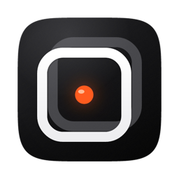
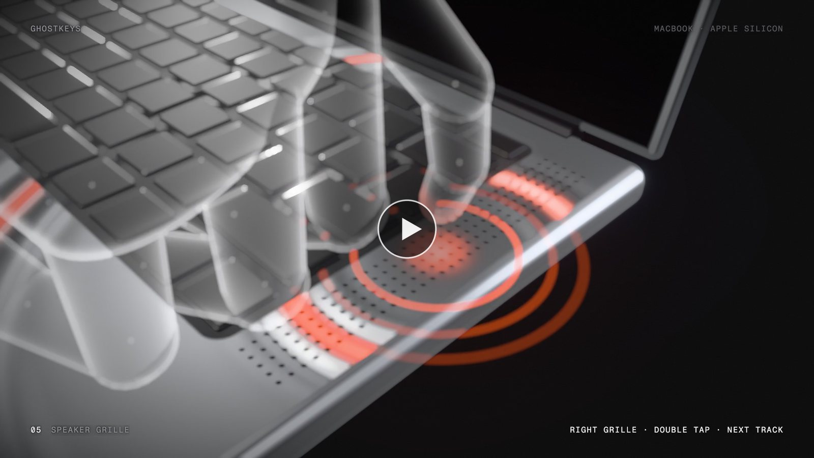
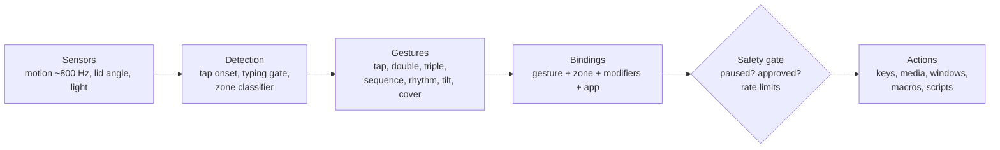
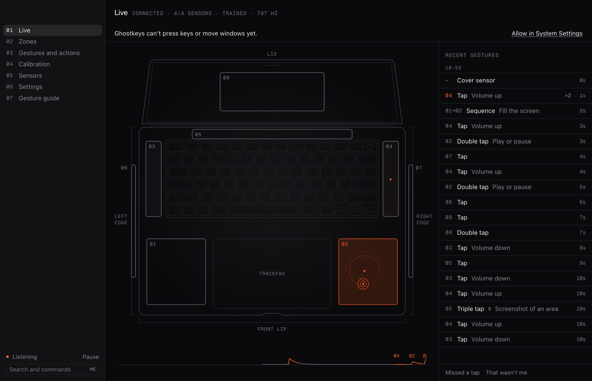
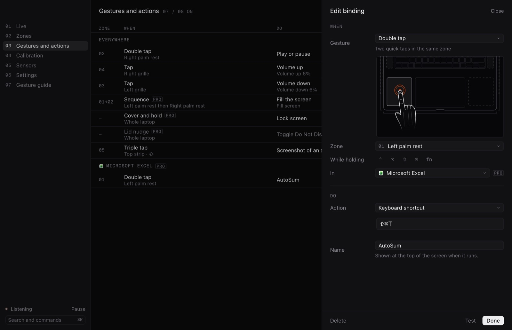
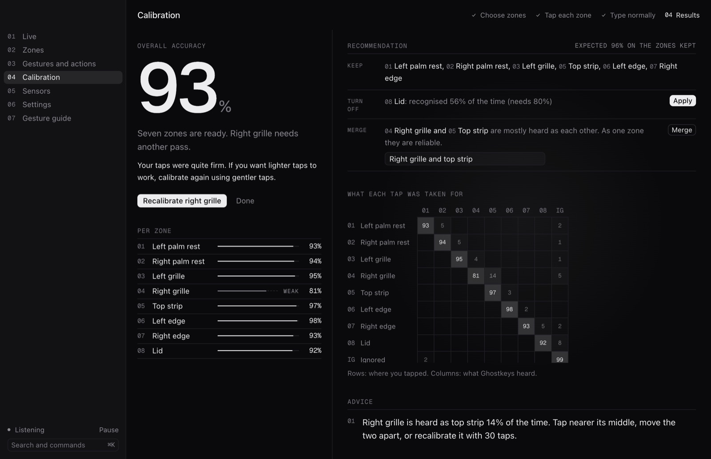
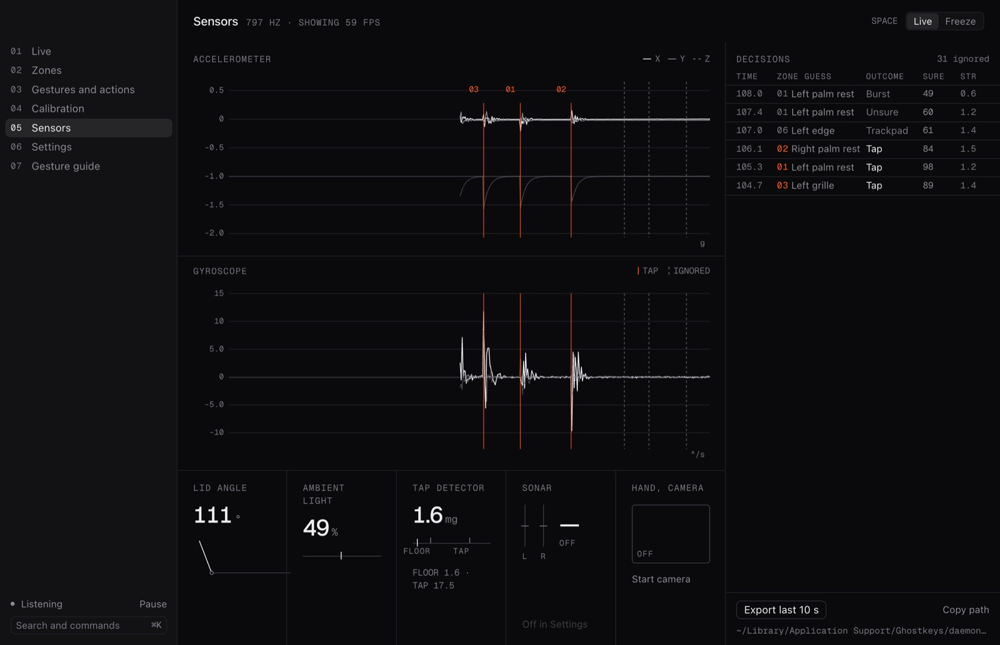

<p align="center">
  
</p>

<h1 align="center">Ghostkeys</h1>

<p align="center"><b>Your MacBook has hidden keys.</b></p>

<p align="center">
Tap the palm rest, the speaker grille, or the strip above the keyboard, and Ghostkeys runs the shortcut you bound to it, using only the sensors already inside your Mac.
</p>

<p align="center">
  <a href="https://ghostkeys-nine.vercel.app"></a>
  <a href="https://ghostkeys-nine.vercel.app/guide/"></a>
  <a href="https://ghostkeys-nine.vercel.app/video/ghostkeys-film.mp4"></a>
  
  
</p>

<p align="center">
  <a href="https://ghostkeys-nine.vercel.app/video/ghostkeys-film.mp4">
    
  </a>
</p>

<p align="center"><sub>Draw a zone · calibrate to your hands · tap the case · the shortcut runs</sub></p>

---

## What is it?

Every MacBook with Apple silicon has a motion sensor, a lid angle sensor, and an ambient light sensor. Ghostkeys reads them, learns what a tap on each blank part of your case feels like, and turns those taps into buttons you can bind to anything.

It is a small background service plus a desktop app, with a few extras around them:

| Component | What it does | Status |
| --- | --- | --- |
| **ghostkeysd** (`daemon/`) | The background service, written in Swift. Reads the sensors, detects taps and gestures, runs actions, and talks to the app over a local connection. | Working on real hardware |
| **Ghostkeys app** (`app/`) | Electron and React desktop app: onboarding, zone editor, calibration, bindings, live view, sensor view, on-screen confirmation (HUD), menu bar icon. | Working; runs from source, not yet signed or notarized |
| **Detection engine** (`daemon/Sources/GhostkeysDetection`) | Turns motion data into zone taps: a tap detector, a per-user classifier (a model that learns which zone a tap came from), and the gesture rules. No outside dependencies. | Working, unit tested, tuned on real recordings |
| **Sound and sonar** (`daemon/Sources/GhostkeysAcoustics`) | Optional. Uses the microphone to tell a knuckle from a fingertip, hear finger rubs, and, with sonar (inaudible tones from the speakers), sense a hand moving above the keyboard. Off by default. | Built and wired into the service; tested in simulation and with synthetic audio only |
| **Camera add-on** (`daemon/Sources/GhostkeysVision`) | Optional. In-air gestures (pinch, pinch drag, palm swipe) seen by the front camera, in short sessions only. Off by default. | Built and wired into the service; tested in simulation only, never on a live camera in tests |
| **Integrations** (`daemon/Sources/GhostkeysIntegrations`) | App-aware commands: Excel formula tools, browser tabs, Music and Spotify, Finder, PowerPoint and Keynote, Zoom. | Implemented; needs macOS Automation permission per app |
| **AI macro composer** (`packages/composer`) | Turns a plain-English request ("double tap the right grille in Excel to wrap the formula in IFERROR") into a checked binding. | Library only, not in the app yet; offline mode passes its own 60-prompt test set, live model mode untested |
| **Presets** (`presets/`) | 242 ready-made actions in 22 categories, plus 6 full layouts, with a validator. | Working; loaded by the app, CLI and Raycast |
| **gk CLI and SDK** (`packages/cli`, `packages/sdk`) | A TypeScript client library for the service, and `gk`, a terminal tool built on it (status, live watch, zones, bindings, calibration, import and export). | Working from source |
| **Raycast extension** (`packages/raycast`) | Status, pause, search bindings, bind a preset, watch gestures, apply a layout, all from Raycast. | Working from source; not in the Raycast Store |
| **Website** (`web/`) | Next.js site with a 3D scroll film, pricing, the user guide, privacy and compatibility pages. | Live at [ghostkeys-nine.vercel.app](https://ghostkeys-nine.vercel.app) |
| **Promo film** (`packages/promo`) | The 70 second film above and a vertical teaser, made in code with Remotion. | Done |
| **Windows port** (`windows/`) | A Rust version of the service that speaks the same protocol. Counts knocks without locating them, since most Windows sensors report too slowly to tell zones apart. | Compiles and passes 100 tests on macOS; has never run on Windows hardware |

## How it works



1. The service reads the motion sensor about 800 times a second, fast enough to catch the shock of a fingertip travelling through the aluminum.
2. Each possible tap becomes a set of measurements (how sharp, which way it pushed, how the case twisted and rang). Your calibrated model decides which zone it came from, or throws it out as typing, trackpad use, or the laptop moving.
3. Accepted taps are grouped into gestures, together with any modifier keys you were holding.
4. The gesture is matched against your bindings, including per-app bindings, then passes the safety gate before the action runs.

The service and the app talk over a WebSocket (a two-way local connection) on `127.0.0.1:47823`, which only your own Mac can reach. The full message contract is in [docs/PROTOCOL.md](docs/PROTOCOL.md).

## Features

<p align="center">
  
</p>
<p align="center"><sub>The Live screen. App screenshots in this README use demo data from the built-in mock service.</sub></p>

**Surfaces.** Left and right palm rests, left and right speaker grilles (MacBook Pro), the strip above the keyboard, the left and right edges, and the back of the lid. You can also draw your own zones. The keyboard and trackpad are always excluded.

**Gestures.**
- On a zone: tap, double tap, triple tap, rhythm (tap, pause, double tap), and sequence (one zone, then another).
- Whole laptop: lid nudge, tilt left or right, cover the light sensor, cover and hold.
- Optional sound mode: knuckle knock, finger rub. Optional sonar: hover to set a level, push, pull, sweep.
- Optional camera: air tap, pinch hold as a knob, pinch drag, palm swipe, two-hand zoom.
- Any gesture can require modifier keys (shift, control, option, command, fn).

**Actions.** Keyboard shortcut, type text, copy to clipboard, volume, mute, media keys, brightness, open an app, file or link, arrange windows, control the front app, system commands (lock, screenshot, Mission Control and more), macOS Shortcuts, AppleScript, shell commands, and app integrations.

<p align="center">
  
</p>

**Per-app layers.** Scope any binding to one app. The same double tap can be AutoSum in Excel and play or pause everywhere else.

**Macros.** Chain up to 50 actions with delays between them, 30 seconds total. A macro stops at the first step that fails.

**Feedback learning.** Two buttons on the Live screen: "Missed a tap" and "That wasn't me". Ghostkeys checks the last few seconds of sensor data and retrains only when the evidence is clear, so one wrong report cannot quietly ruin the model. Every retrain keeps a backup of the previous model.

**Calibration.** Tap each zone (20 times by default), then type and use the trackpad normally so Ghostkeys learns what a tap is not. You get accuracy per zone, a table of which zones get mixed up, and a recommendation: which zones to keep, which to turn off, and which two to merge into one.

<p align="center">
  
</p>

**Sensors view.** Live accelerometer and gyroscope graphs, every detection decision with its reason, and an "Export last 10 s" button that saves a recording you can replay offline.

<p align="center">
  
</p>

## Supported Macs

| Mac | What works |
| --- | --- |
| MacBook Pro or Air with M1 Pro, M1 Max, M2 or later (including M3, M4, M5 and their Pro and Max chips) | Everything: tap zones, every gesture, calibration |
| M4 and M5 Macs | Everything above, plus the optional camera add-on |
| Base M1 (2020 MacBook Air, 2020 13" MacBook Pro) | Light sensor gestures only. These Macs do not publish the motion sensor, so tap zones do not work |
| Intel Macs | Not supported. There is no motion sensor to stream |
| Windows laptops | In progress. See the Windows row above |

Requires macOS 14 (Sonoma) or later. To see exactly what your Mac streams, build the service and run `ghostkeysd --selftest`.

## Quick start

There is no signed download yet, so today you build from source. You need an Apple silicon Mac on macOS 14 or later, the Xcode Command Line Tools (Swift 5.9 or later), Node 20 or later, and pnpm.

**1. Build the service**

```bash
cd daemon
swift build                           # builds .build/debug/ghostkeysd
.build/debug/ghostkeysd --selftest    # opens the sensors for 3 s, prints rates, exits 0 or 1
```

**2. Run the app**

```bash
cd app
pnpm install
pnpm dev          # starts the app; it finds and starts daemon/.build/debug/ghostkeysd itself
```

No Mac sensors handy, or just want to look around? `pnpm dev:mock` runs the app against a fake service. To build a local `Ghostkeys.app`, run `pnpm build:mac` (output in `app/release/`, unsigned).

Then:

1. Confirm your Mac model in onboarding.
2. Grant Accessibility when asked. Volume and mute work without it, so they are a good first test.
3. Calibrate, bind a gesture, and tap.

**Optional extras**

```bash
# gk command-line tool
pnpm --dir packages/sdk install && pnpm --dir packages/sdk build
pnpm --dir packages/cli install && pnpm --dir packages/cli build
pnpm --dir packages/cli start -- status

# website, served locally at http://127.0.0.1:4317
cd web && pnpm install && pnpm build && pnpm serve
```

The `gk` commands are listed in [packages/cli/README.md](packages/cli/README.md). Useful service flags: `--dry-run` (log actions instead of running them), `--verbose`, `--port N`, and `--simulate-sensors` (fake motion data, no hardware touched).

## Safety and privacy

**What it reads.** The motion sensor, the lid angle sensor, the ambient light sensor, how long since your last keystroke or click (never which key), and which app is in front (by its ID, for per-app bindings). The microphone and camera are used only if you turn on those add-ons, and only during a session with a time limit. macOS shows its own orange or green indicator whenever they are on.

**What it never stores.** Anything you type. Audio or video. Raw sensor data, unless you press "Export" or report a missed tap, and then only the last few seconds, on your Mac. Calibration keeps the measurements of your calibration taps, so the model can be retrained without asking you to tap again.

**What it never does.**
- Never asks for `sudo` or an admin password, and installs no kernel extension, launch daemon, or login item.
- Never changes System Settings.
- The service and app never talk to the network. There is no telemetry and no account.
- Never writes outside `~/Library/Application Support/Ghostkeys/`.

**How the local connection is protected.**
- **Token.** On every launch the service writes a fresh random token to a file only you can read. Every connection must present it.
- **No browsers.** Any connection that carries an `Origin` header, which browsers always send, is refused. So a web page cannot drive your Mac through Ghostkeys.
- **Approvals.** Shell commands, AppleScript, Shortcuts and "open" actions run only after you confirm the exact command in a native dialog. Editing the command cancels the approval. Commands such as `sudo`, `rm -rf`, `diskutil` or `curl | sh` are refused even when approved.
- **Rate limits.** At most 5 actions a second and 60 a minute. Crossing either pauses Ghostkeys. Each binding also has a short cooldown.
- **Sensor restore.** The service changes two motion sensor driver settings so it can stream. It saves the originals to disk first, and puts them back on quit, and after a crash on the next start. It never writes to the light or lid sensors, which macOS itself relies on.

These protections came out of an internal audit, [docs/audit/SAFETY_AUDIT.md](docs/audit/SAFETY_AUDIT.md), which found that an earlier version accepted connections from any web page. That is fixed. To report a problem, see [SECURITY.md](SECURITY.md).

## Accuracy today

These numbers come from one M5 Pro 16" MacBook Pro and one person's hands. Treat them as a first data point, not a promise.

- **Palm rests and the top strip are strong.** First real calibration (8 zones): palm rests 95%, top strip 90%.
- **Speaker grilles are good after a careful calibration.** 90% and 93% in that same run. A later quick recalibration with only 6 right grille taps got 17% on that zone, so the number of taps matters.
- **Edges and the lid are unreliable.** In that run the lid was recognized 65% of the time and the left edge 29%. Calibration results now suggest turning weak zones off; with them off, tap recall was 91% with 2% wrong-zone taps at the default confidence.
- **Gentle taps are heard but not placed.** In an offline replay test, very light taps (8 to 15 thousandths of a g) were detected 37 times out of 39, but put in the right zone only 4 times. The light-touch setting is off by default for this reason.
- **Sound, sonar and camera are tested in simulation only**, not yet with real hands on real hardware.

The analysis behind these numbers is in [daemon/analysis/README.md](daemon/analysis/README.md).

## Pricing

Planned: **Free** (both palm rests, tap, double and triple tap, 10 bindings), **Pro** at $29 once with 12 months of updates, **Pro Student** at $15, and **Teams** at $49 per seat per year. Licenses are meant to be checked offline, with no check-ins. Checkout is not live yet, and the current app gates nothing. Details on the [pricing page](https://ghostkeys-nine.vercel.app/pricing/) and in [docs/pricing/PRICING.md](docs/pricing/PRICING.md).

## Repository layout

| Path | What is in it |
| --- | --- |
| [`daemon/`](daemon) | Swift package: `ghostkeysd`, the detection, sound, camera and integrations libraries, and `ghostkeys-lab` (record and replay tool) |
| [`daemon/analysis/`](daemon/analysis) | Python scripts used to tune detection on real recordings |
| [`app/`](app) | Electron and React desktop app |
| [`packages/sdk/`](packages/sdk) | TypeScript client for the service |
| [`packages/cli/`](packages/cli) | `gk` command-line tool |
| [`packages/raycast/`](packages/raycast) | Raycast extension |
| [`packages/composer/`](packages/composer) | AI macro composer library and its test set |
| [`packages/promo/`](packages/promo) | Promo film and teaser (Remotion) |
| [`presets/`](presets) | Preset library, layouts, schema, validator |
| [`web/`](web) | Website (Next.js, static export) |
| [`windows/`](windows) | Rust port of the service for Windows |
| [`packaging/`](packaging) | Scripts to build the app bundle and DMG, signing notes, Homebrew formula draft |
| [`tests/e2e/`](tests/e2e) | End-to-end tests that drive a real service over its WebSocket |
| [`assets/`](assets) | App icon and DMG artwork |
| [`docs/`](docs) | Protocol, user guide, pricing, audit, reviews, design brief, pitch material |

## Development

```bash
# Swift unit tests (works with only the Command Line Tools, where plain `swift test` silently runs nothing)
cd daemon && scripts/run-tests.sh

# End-to-end tests against a real service. Quit the Ghostkeys app first: the tests need the sensor lock.
cd tests/e2e && python3 -m venv .venv && .venv/bin/pip install -r requirements.txt && .venv/bin/pytest

# TypeScript packages
pnpm --dir packages/sdk test
pnpm --dir packages/cli test
pnpm --dir packages/composer test
cd packages/raycast && npm install && npm test

# App checks
pnpm --dir app typecheck && pnpm --dir app lint

# Presets
node presets/validate.mjs

# Windows port (type-checks and tests on a Mac)
cd windows && cargo test
```

The latest end-to-end run passed 107 tests with 2 skipped ([tests/e2e/REPORT.md](tests/e2e/REPORT.md)). How to contribute: [CONTRIBUTING.md](CONTRIBUTING.md).

## Documentation

Everything is indexed in [docs/README.md](docs/README.md): the user guide, the protocol, pricing, the safety audit, reviews, and each component's own README. The guide is also on the [website](https://ghostkeys-nine.vercel.app/guide/).

## Status and roadmap

Ghostkeys started as a hackathon project and is early. What works today: tap zones, calibration, gestures, bindings, macros, per-app layers and the feedback loop on real hardware, plus the CLI, SDK and Raycast extension from source.

Next:
- A signed and notarized download.
- Real-hardware testing of sound mode, sonar and the camera add-on.
- The AI composer inside the app.
- Offline license checks with real signatures, and checkout.
- A first run of the Windows port on real Windows laptops.
- Better accuracy on edges and the lid.

## Credits

Built by [Soham Aggarwal](https://github.com/Soham109). The hand-wave sonar builds on SoundWave (Gupta et al., CHI 2012). The website and film use Switzer (Fontshare) and Fragment Mono. The film's voiceover was generated with ElevenLabs.

## License

Not chosen yet. The repository has no license file, so no reuse rights are granted for now. (The `sdk`, `cli` and `raycast` packages declare MIT in their `package.json`, but there is no repository-wide license.)
